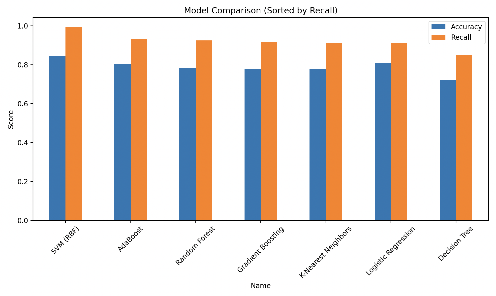
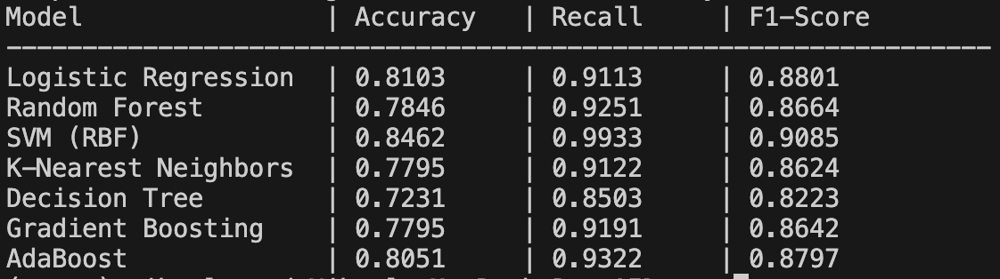

# Parkinson’s Disease Detection via Acoustic Analysis of Dysphonia

This project implements a Deep Learning classifier using **PyTorch** to predict the presence of Parkinson's Disease (PD) based on biomedical voice measurements. By analyzing vocal fluctuations (dysphonia), the model identifies patterns associated with the early stages of the disease that are often imperceptible to the human ear.

## Overview
Parkinson's Disease affects muscle control, including the muscles used for speech. This AI utilizes a **Multi-Layer Perceptron (MLP)** architecture to analyze 22 distinct acoustic features—such as pitch jitter, amplitude shimmer, and harmonic noise ratios—to classify patients as either "Healthy" or "Parkinson's."

For reference, when the term "dysphonia" is used, typically it refers to a voice disorder characterized by difficulty speaking, resulting in a raspy, shaky voice, or changes in pitch and quality.

## Dataset
The model is trained on the **UCI Parkinson’s Data Set**.
* **Source:** [UCI Machine Learning Repository](https://archive.ics.uci.edu/ml/datasets/parkinsons)
* **Samples:** 195 biomedical voice recordings.
* **Key Features:** `MDVP:Jitter(%)`: Frequency variation in vocal cord vibration.
    * `MDVP:Shimmer`: Amplitude (loudness) instability.
    * `HNR`: Harmonics-to-Noise Ratio (clarity vs. breathiness).
    * `PPE`: Pitch Period Entropy (measures of vocal chaos).

## Model Architecture
The neural network is built with **PyTorch** and consists of:
* **Input Layer:** 22 neurons (matching the UCI feature set).
* **Hidden Layers:** Two fully connected layers (64 and 32 neurons) using **ReLU** activation.
* **Output Layer:** 1 neuron with **Sigmoid** activation (via `BCEWithLogitsLoss` during training) for binary classification.
* **Optimizer:** Adam
* **Preprocessing:** `StandardScaler` from Scikit-Learn to normalize feature ranges.

## Installation & Usage

### 1. Clone the repository
```bash
git clone https://github.com/Brainspark1/AI-Parkinsons-Disease-Detection-via-Acoustic-Analysis-of-Dysphonia.git
```

### 2. Set up the environment
```bash
python3 -m venv venv
source venv/bin/activate  # On Windows use: venv\Scripts\activate
pip install -r requirements.txt
```

### 3a. Terminal Training
Place the parkinsons.data file in the ```data/``` directory.
```bash
python3 train.py
```
Then, compare machine learning models by running
```bash
python3 compare_models.py
```

### 3b. Jupyter Notebook
For a more visual experience with step-by-step explanations and loss plots, use the provided notebook ```Parkinsons_Detection.ipynb```
Ensure the environment is activated and jupyter is installed. Then, launch the notebook.
```bash
jupyter notebook Parkinsons_Detection.ipynb
```

## Results and Findings

Figure 1: Comparison of machine learning models by recall and accuracy


Figure 2: Side-by-side listing of machine learning models by recall and accuracy

## Conclusion
Analysis of the gathered data reveals a trade-off between precision and sensitivity. While Logistic Regression achieved a high accuracy of 81.03%, the Support Vector Machine (SVM) demonstrated a recall of 99%. In a medical diagnostic context, recall is arguably the more vital metric; a 99% recall suggests that only 1% of patients with Parkinson's were incorrectly identified as healthy. 

## Medical Disclaimer

> **IMPORTANT:** This project is part of an AI research exercise and is intended for **educational and research purposes only**. 
>
> * **Not a Diagnostic Tool:** The predictions generated by this model should not be used as a substitute for professional medical advice, diagnosis, or treatment.
> * **Clinical Validation:** The analysis is based on a specific public dataset and has not been clinically validated for real-world medical use.
> * **Consult a Professional:** If you or someone you know is concerned about Parkinson's Disease or any other health condition, please consult a qualified healthcare provider or neurologist.

---

For any questions, feel free to reach out to [brainsparkteam@gmail.com](mailto:brainsparkteam@gmail.com).
